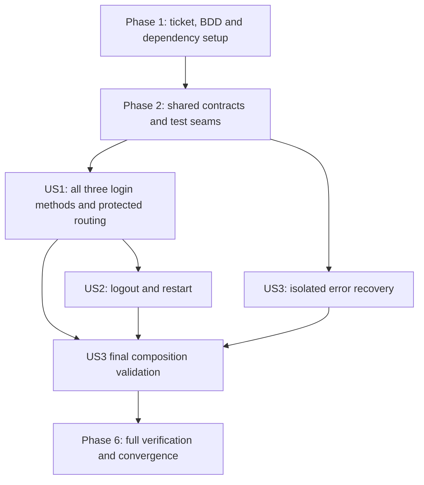

# Tasks: Mobile Login and Error Recovery

**Input**: Design documents in `specs/003-mobile-auth-recovery/`; [spec](spec.md), [plan](plan.md), [research](research.md), [data model](data-model.md), [authentication contract](contracts/authentication.md), [scenario/test map](contracts/scenario-tests.md), [quickstart](quickstart.md).

**Ticket**: WEA-10 mobile slice. The web/signup/invitation scope in Linear is not implemented by this task list.

**Prerequisites**: Completed planning; user-approved email/password + email code + Google, existing accounts only and iOS17+. User confirmed the complete S01–S20 coverage on 2026-10-07; workflow.json records the exact agreement. T001 completed: actual checkout is feat/WEA-10/mobile-auth-recovery from verified remote develop.

**Tests**: Mandatory under root AGENTS.md and constitution; spec/plan require public behavioral seams. For every authored behavior write/execute a meaningful failing case first, implement minimum GREEN, refactor while green and record actual evidence. Native shell/tooling setup is permitted to make the harness callable, but an import/build/tooling error is never behavioral RED.

**Organization**: Six phases, three P1 stories, sequential task IDs. `[P]` means different files after stated prerequisites, not blanket authorization to overlap dependent work. A task that says RED must execute and preserve that failure before its dependent implementation. A GREEN task includes refactor verification and evidence. Paths are repository-relative; resolve them from repository root when executing.

## Phase 1: Setup (Shared Infrastructure)

**Purpose**: Establish ticket isolation, agreed scenarios, and reproducible dependency/toolchain prerequisites before source work. These tasks do not authorize remote Clerk settings or account provisioning.

- [x] T001 Preserve specs/003-mobile-auth-recovery/ outside any destructive checkout, inspect the current remote develop and create/reuse feat/WEA-10/mobile-auth-recovery from develop; keep unrelated WEA-8 changes out unless merged. Read AGENTS.md, apps/mobile/AGENTS.md and docs/standards/{README,typescript,react-native,architecture,testing-and-delivery}.md; record branch/base and repository-local personal author/committer checks in specs/003-mobile-auth-recovery/evidence.md. Do not commit/push during setup.
- [x] T002 Present the complete S01–S20 happy/sad/edge coverage in specs/003-mobile-auth-recovery/spec.md for actual user agreement; record the exact confirmation and scenario IDs in specs/003-mobile-auth-recovery/workflow.json only after agreement. Keep the already approved three methods, existing accounts only and iOS17+; source tasks are blocked until scenariosConfirmed is true. Preserve contracts/scenario-tests.md as the public seam map.
- [x] T003 Inspect locally installed RN/native build APIs and pinned upstream Clerk APIs against specs/003-mobile-auth-recovery/research.md; verify compatible Kotlin/AGP/JDK and Xcode/Swift6.2 requirements and exact Android no-transfer OAuth entrypoint. Document owner-supplied Native API, Google, same web/mobile instance, callbacks and existing test-account prerequisites in apps/mobile/README.md; do not change shared signup policies or provision accounts. If compatibility requires changing agreed behavior, update the spec before dependent work.
- [x] T004 Adopt exact compatible @react-navigation/native/native-stack v7 and react-native-screens v4 patches with existing safe-area-context, ClerkKit1.6.0 and clerk-android-api1.1.11; preserve React19.2.3/RN0.86.3 and develop’s hoisted npm workspaces; exclude the unmerged WEA-8 migration. Edit apps/mobile/package.json, apps/mobile/android/app/build.gradle, apps/mobile/ios/Weave.xcodeproj/project.pbxproj and root package-lock.json; resolve committed native locks including apps/mobile/ios/Podfile.lock and apps/mobile/ios/Weave.xcworkspace/xcshareddata/swiftpm/Package.resolved. Verify the actual workspace lock location; do not treat ignored xcworkspace contents as committed—add the narrow lockfile tracking exception in .gitignore if needed. Add locked Swift-package resolution to the native CI setup in .github/workflows/ci.yml without modifying Turborepo task behavior.
- [x] T005 Apply user-approved iOS17+ app/test deployment targets and Podfile platform in apps/mobile/ios/Weave.xcodeproj/project.pbxproj and apps/mobile/ios/Podfile. Select/verify a Swift6.2-capable Xcode in .github/workflows/ci.yml and keep frozen Swift package resolution; review Android toolchain compatibility in apps/mobile/android/build.gradle. Native setup must preserve Community CLI and both projects, without Expo or release signing. Verify RN hoisting-aware CocoaPods integration remains reproducible; do not overwrite existing native project ownership.

**T003 decision**: User accepted scoped maintained SDK logging patches on 2026-10-08; see workflow.json and SDK compatibility evidence. Native source dependencies retain upstream revisions/licenses. Pinned renderer diagnostics are now sanitized with actual capability RED/GREEN; swallowed per-key SDK persistence failures remain an explicit plan-level follow-up gap.

**Checkpoint**: Branch, full scenario agreement and dependency/platform decisions are recorded. No authored behavior starts before T002; runtime/build incompatibility is reported rather than waived.

---

## Phase 2: Foundational (Blocking Prerequisites)

**Purpose**: Establish shared contracts and executable public seams. Every behavioral foundation follows RED → GREEN → REFACTOR; scaffolding/import/codegen failures are never behavioral red. Foundation tests can use fakes without live credentials.

- [x] T006 Define readonly model interfaces and gateway/Clock ports in apps/mobile/src/auth/domain/auth-models.ts, apps/mobile/src/auth/application/authentication-gateway.ts and apps/mobile/src/auth/application/clock.ts; publish canonical tokens in apps/mobile/src/auth/auth.tokens.ts. Quote/enforce data-model constraints: "`status`: `resolving`, `signedOut`, `active`, or `unavailable`"; "`sessionId`, `accountId`: opaque IDs present only in an active snapshot; never equivalent to session credentials"; "`generation`: monotonically increasing application epoch to discard late responses"; "`revision`: increasing native adapter state sequence within an epoch, used to order callbacks"; "`validatedAt`: time of successful fresh session validation, for lifecycle decisions; not a client-created authorization proof". Also preserve "`accountId`: opaque provider ID, used only after authentication; no local profile replica". No framework imports in domain/application.
- [x] T007 Define attempt/safe-error interfaces in apps/mobile/src/auth/domain/auth-models.ts: "`method`: `password`, `emailCode`, or `google`"; "`stage`: idle, submitting, awaitingCode, verifying, awaitingProvider, or failed"; "`attemptId`: opaque adapter handle for the current native attempt; invalidated by method switch, reload, logout, and a newer attempt"; "`email`: form input held only while needed; trim surrounding whitespace and delegate authoritative identity validation to the provider"; "`retryAfterSeconds`: optional provider-supplied rate-limit hint; no made-up OTP lifetime or resend entitlement"; "`codePurpose`: sign-in or provider-required email device-trust challenge. Supporting existing email-code verification does not enroll MFA". Safe-error constraints: "`code`: invalidInput, rejectedCredentials, codeInvalid, codeExpired, rateLimited, existingAccountRequired, cancelled, network, timeout, configuration, verificationRequired, storage, or unexpected"; "`messageKey`: app-owned user-facing copy; raw native/provider messages are not automatically safe"; "Optional `retryAfterSeconds` and affected field identifier; no request payload, token, email, stack trace, or provider object". Preserve them exactly.
- [x] T008 Create apps/mobile/src/native/NativeWeaveAuth.ts codegen schema and register minimum callable platform shells in apps/mobile/android/app/src/main/java/si/tryweave/auth/WeaveAuthModule.kt and apps/mobile/ios/Weave/Auth/WeaveAuthModule.swift, with required Objective-C++ binding in apps/mobile/ios/Weave/Auth/WeaveAuthModule.mm. Configure codegen in apps/mobile/package.json and module registration in native composition roots. Establish controlled typed results and native contract harness: configure the WeaveTests Xcode test target and Android unit-test dependency in apps/mobile/ios/Weave.xcodeproj/project.pbxproj and apps/mobile/android/app/build.gradle; add planned test:native:android and test:native:ios commands to apps/mobile/package.json and docs in apps/mobile/README.md. Wire both commands into the corresponding required mobile-native jobs in .github/workflows/ci.yml alongside compilation, using a runnable iOS simulator destination for test execution. CI must execute all authored native contract tests, fail on test failures, and retain test results; compilation alone is insufficient. Shells return unavailable and implement no login behavior. Create callable TypeScript gateway/controller shells in apps/mobile/src/auth/infrastructure/native-auth-gateway.ts and apps/mobile/src/auth/application/auth-controller.ts that satisfy the published ports without implementing their behavior. Native shells accept injected SDK service fakes for tests. Confirm module load/codegen and harness imports before behavioral tests.
- [x] T009 Write and run meaningful failing boundary/config/privacy cases in apps/mobile/src/auth/auth-gateway.contract.test.ts for FR-012, S04/S12 and missing config: invalid/unknown native results, safe rejection narrowing, secure-storage errors and seeded-secret redaction. Use controlled module responses through a minimal callable adapter seam rather than failing imports; save actual RED command/result in specs/003-mobile-auth-recovery/evidence.md.
- [x] T010 Implement runtime validation, app-owned safe-error mapping and configuration bootstrap for the preceding RED in apps/mobile/src/auth/infrastructure/native-auth-gateway.ts and apps/mobile/src/auth/infrastructure/auth-config.ts; add public-only configuration examples to apps/mobile/.env.example and resource/build injection to native project configuration. "No secret key reaches JavaScript or native resources"; "UI models, routes, passwords, codes, and provider error objects are not persisted". Missing config must allow a mounted fail-closed error state. GREEN/refactor while rerunning contract tests and record outputs in specs/003-mobile-auth-recovery/evidence.md.
- [x] T011 Write and run RED session/lifecycle cases through AuthenticationGateway and Clock in apps/mobile/src/auth/auth-controller.test.ts for S04/S05/S07: active/inactive/unavailable, initialization/foreground fresh resolution, ordered revision/generation updates, unsubscribe/disposal and 30-second deadline. "Unknown, unavailable, incomplete verification, and unrecognized provider states never unlock Home". Save expected failures in specs/003-mobile-auth-recovery/evidence.md.
- [x] T012 Implement shared session-resolution/subscription controller in apps/mobile/src/auth/application/auth-controller.ts against the preceding RED. Enforce "active requires a completed authentication flow, an active provider session, no pending provider session tasks, and successful session validation. A cached user object alone is insufficient". Bind gateway/Clock through a typed factory/Context in apps/mobile/src/auth/presentation/auth-context.tsx; framework lifecycle integration stays in presentation. GREEN/refactor and record controller evidence using controlled AuthenticationGateway fakes. Assert that the controller requests fresh validation and never treats cached identity as authorization. This task implements no production native session-validation behavior: native shells remain unavailable, with actual fresh validation tested RED in T014 and implemented GREEN in T016/T017.
- [x] T013 Write/run RED accessible field/feedback behaviors in apps/mobile/src/components/form-field.test.tsx and apps/mobile/src/components/feedback.test.tsx for S03/S15: labels, secret entry, validation announcement and disabled/busy semantics. Then add required primitives in apps/mobile/src/components/form-field.tsx and apps/mobile/src/components/feedback.tsx using existing Button/Screen/Typography and semantic tokens; GREEN/refactor each behavior and document variants in docs/standards/component-catalogue.md with evidence in specs/003-mobile-auth-recovery/evidence.md.

**Checkpoint**: Gateway/controller contract and native shell seams are available, shared controller behavior tests are green against gateway fakes, native shells remain unavailable, and source boundaries remain framework-free. Stories use those tested seams; native login/logout behavior remains story-owned.

---

## Phase 3: User Story 1 — Sign in and access Home (Priority: P1)

**Goal**: Existing accounts authenticate with each of the three methods; only valid sessions expose Home.

**Independent Test**: With controlled active/inactive/resolving/error states, exercise the actual Login and native-stack UI, all three successful methods, rejected/unknown accounts, duplicate taps, direct Home requests and Back. Verify real provider sign-in separately on both platforms. Covers S01–S08, S16–S20 and shared S15.

- [x] T014 [P] [US1] Write/run RED password/email-code and Google no-transfer adapter tests for S02/S03/S16/S18/S19/S20 in apps/mobile/android/app/src/test/java/si/tryweave/auth/WeaveAuthModuleTest.kt and apps/mobile/ios/WeaveTests/WeaveAuthModuleTests.swift. Inject SDK service seams to prove email device-verification request/verify/resend and invalid/expired/rate-limited outcomes, blocked unsupported MFA/session tasks without activation or policy bypass, verification completion, fresh session validation rather than cached-user trust, ordered invalidation, secure-storage failures, false transfer flag, unknown-account rejection and no signup invocation; native test targets must load first. Save each meaningful failure in specs/003-mobile-auth-recovery/evidence.md.
- [x] T015 [US1] Write/run RED login-operation cases in apps/mobile/src/auth/auth-controller.test.ts for S02/S03/S04/S08/S16/S17/S18/S19/S20: password outcomes, code and password-triggered email device-verification request/verify/resend, rate limits, unsupported MFA/tasks returning usable method selection without bypass, Google cancellation/120-second foreground deadline, concurrent method taps and abandoned attempts. Assert eventual native session reconciliation for late results, not only hidden Home. Save actual RED evidence in specs/003-mobile-auth-recovery/evidence.md.
- [x] T016 [P] [US1] Implement Android password, email OTP and password-triggered email device-verification request/verify/resend, native fresh-session validation/events and Google sign-in-only flow behind apps/mobile/android/app/src/main/java/si/tryweave/auth/WeaveAuthModule.kt and apps/mobile/android/app/src/main/java/si/tryweave/auth/ClerkAuthService.kt. Use pinned low-level SignIn.authenticateWithRedirect with transferable=false; reject incomplete/provider-task states and signup transfer. Leave secure credentials with the SDK, map storage failures safely and suppress raw SDK/application logging. GREEN/refactor against T014 tests; record exact test command/results in specs/003-mobile-auth-recovery/evidence.md.
- [x] T017 [P] [US1] Implement iOS password, email OTP and password-triggered email device-verification request/verify/resend, native fresh-session validation/events and Google via auth.signInWithOAuth(provider:.google, transferable:false) in apps/mobile/ios/Weave/Auth/WeaveAuthModule.swift and apps/mobile/ios/Weave/Auth/ClerkAuthService.swift. Retain SDK Keychain persistence; reject incomplete/provider-task states, map storage failures and suppress raw SDK/application logging. GREEN/refactor against T014 tests; record exact test command/results in specs/003-mobile-auth-recovery/evidence.md.
- [x] T018 [US1] Implement login commands, challenge state and deadlines in apps/mobile/src/auth/application/auth-controller.ts and method bindings in apps/mobile/src/auth/infrastructure/native-auth-gateway.ts against T015 RED. "Only one pending operation across login methods; use operation ID plus generation to prevent duplicate and stale activation"; "Password and code: transient secrets held only for submission, cleared on completion/cancel/reset; never persisted or logged. Do not trim passwords"; "Unknown identity → sanitized existing-account-required error. Do not transfer to signup or create a user"; "Unsupported required MFA/session tasks → clear blocked-login feedback, usable return to method selection, no policy bypass and no Home; a future scope change is required to implement new challenge types". GREEN/refactor and record evidence.
- [x] T019 [P] [US1] Write/run RED Login UI cases in apps/mobile/src/auth/login.test.tsx for S02/S03/S08/S15/S16/S17/S18/S19/S20: three choices, sign-in/device-verification code mode request/verify/resend/back-to-method, unsupported verification feedback and usable controls, provider errors/cancel, existing-account copy, cleared secrets, pending controls and keyboard/labels. Fake gateway results use the published contract; record behavior failures in specs/003-mobile-auth-recovery/evidence.md.
- [x] T020 [P] [US1] Write/run RED actual-navigation cases in apps/mobile/src/navigation/root-navigator.test.tsx for S01/S02/S05/S06/S07: no route flash while resolving, inactive Home request denied, unknown link/stale history denied, completed login removing Login history and invalidation removing Home. Do not only assert a route-selection function. Record RED in specs/003-mobile-auth-recovery/evidence.md.
- [x] T021 [US1] Build single-route three-method Login in apps/mobile/src/auth/presentation/login-screen.tsx with feature hooks in apps/mobile/src/auth/presentation/use-login.ts against T019 RED. Reuse tested primitives; keyboard-aware scroll layout, safe areas, accessible feedback and method changes abandoning old attempts are required. GREEN/refactor and record S02/S03/S08/S15/S16/S17/S18/S19/S20 results in specs/003-mobile-auth-recovery/evidence.md.
- [x] T022 [US1] Implement exactly Login/Home with no route params in apps/mobile/src/navigation/root-navigator.tsx and composition in apps/mobile/App.tsx against T020 RED. Resolving/unavailable feedback remains outside routes; no auth-transition imperative navigation or saved history. Create apps/mobile/src/auth/presentation/home-screen.tsx with the sole Logout action delegating to the contract; its working logout is implemented in US2. GREEN/refactor and record S01/S02/S05/S06/S07 evidence in specs/003-mobile-auth-recovery/evidence.md.
- [x] T023 [P] [US1] Add Android SDK-owned OAuth callback/native application bootstrap in apps/mobile/android/app/src/main/AndroidManifest.xml and apps/mobile/android/app/src/main/java/si/tryweave/MainApplication.kt; implement documented screens fragment restoration/predictive-back wiring in apps/mobile/android/app/src/main/java/si/tryweave/MainActivity.kt. Confirm callback URI matches the registered package and SDK handler; never route OAuth credentials through RootNavigator. Extend native RED tests before authored callback behavior and record GREEN/refactor in specs/003-mobile-auth-recovery/evidence.md.
- [x] T024 [P] [US1] Add iOS SDK bootstrap/callback forwarding and URL registration in apps/mobile/ios/Weave/AppDelegate.swift and apps/mobile/ios/Weave/Info.plist, plus required associated-domain entitlements in apps/mobile/ios/Weave/Weave.entitlements; values match owner-supplied environment identity. Extend native RED tests before authored callback behavior; reject stale/unrelated callbacks and record GREEN/refactor in specs/003-mobile-auth-recovery/evidence.md.
- [ ] T025 [US1] Run the US1 subset of contracts/scenario-tests.md on both platforms using apps/mobile/src/auth/{auth-controller.test.ts,auth-gateway.contract.test.ts,login.test.tsx} and apps/mobile/src/navigation/root-navigator.test.tsx; validate all three live login methods, email device verification and unsupported verification feedback using existing owner-provided test accounts, unknown-user zero-account-creation, no protected-content flash, cancellations and callback handoff. Record S01–S08/S16–S20 plus S15 and explicit missing prerequisites in specs/003-mobile-auth-recovery/evidence.md; repair behavior gaps through RED/GREEN/refactor before claiming this story complete.

**Checkpoint**: US1 can be demonstrated with controlled signed-out/signed-in state and all three login methods. It is an internal milestone: the requested usable minimum still requires working Logout and top-level recovery.

---

## Phase 4: User Story 2 — Log out (Priority: P1)

**Goal**: The sole Home action accurately clears the session or shows retryable failure, without duplicate requests or stale protected history.

**Independent Test**: Inject an active session without requiring a Login interaction; activate Logout, model full/partial failure, use Back and reopen. Covers S09–S11 and shared S15.

- [x] T026 [US2] Write/run RED native signout/persistence tests in apps/mobile/android/app/src/test/java/si/tryweave/auth/WeaveAuthModuleTest.kt and apps/mobile/ios/WeaveTests/WeaveAuthModuleTests.swift for S09/S10: current-session clear, secure-store clear failure and remote-failure/locally-cleared reconciliation. Do not accidentally sign out every session on other devices; capture contract failures in specs/003-mobile-auth-recovery/evidence.md.
- [x] T027 [US2] Write/run RED Logout controller/UI/history cases in apps/mobile/src/auth/auth-controller.test.ts, apps/mobile/src/auth/home.test.tsx and apps/mobile/src/navigation/root-navigator.test.tsx for S09–S11: duplicate pending taps, active/cleared/unknown failure outcomes, late sign-in vs logout, removed Home history and restart after clear. Record RED evidence in specs/003-mobile-auth-recovery/evidence.md.
- [x] T028 [US2] Implement current-session signout and actual local/provider reconciliation in apps/mobile/android/app/src/main/java/si/tryweave/auth/ClerkAuthService.kt and apps/mobile/ios/Weave/Auth/ClerkAuthService.swift, exposed by each WeaveAuthModule. On partial failure return accurate state; compensate late obsolete native sign-in activation before publishing signedOut. GREEN/refactor against T026 and record S09/S10 evidence in specs/003-mobile-auth-recovery/evidence.md.
- [x] T029 [US2] Implement Logout command and pending/error hooks in apps/mobile/src/auth/application/auth-controller.ts and apps/mobile/src/auth/presentation/home-screen.tsx against T027 RED. Keep Home to one interactive Logout action; reuse it for retry, report pending accessibly and remove protected history through session-driven navigation. GREEN/refactor and record S09–S11 in specs/003-mobile-auth-recovery/evidence.md.
- [ ] T030 [US2] Validate S09–S11 independently with active-session gateway fixtures, native restart/back checks, failed logout and rapid tapping; record commands/manual outcomes and S15 labels/feedback in specs/003-mobile-auth-recovery/evidence.md using contracts/scenario-tests.md. Refactor only while the complete US1+US2 regression subset stays green.

**Checkpoint**: Logout is independently testable using active-session fixtures and live session restart. Existing-account login and logout both remain green.

---

## Phase 5: User Story 3 — Recover from an unexpected screen failure (Priority: P1)

**Goal**: Catchable subtree errors replace the entire failed UI with a safe Reload screen; explicit retry rechecks authentication and persistent faults never loop.

**Independent Test**: Mount the boundary with controlled throwing root/provider/navigation/screen children; Reload with valid/absent/invalid snapshots without depending on a completed sign-in journey. Covers S12–S14 and shared S15.

- [x] T031 [P] [US3] Write/run RED boundary/fallback/Reload tests in apps/mobile/src/recovery/app-error-boundary.test.tsx for S12–S15: root/provider/navigation/screen errors, token/raw-stack exclusion, accessible Reload, safe-area/provider-independent fallback, valid/absent/invalid fresh session resolution, repeated failure and disposal/late results. "`rootGeneration`: increments once per explicit Reload activation"; "`hasError`: UI-only flag within the current boundary". Record actual RED in specs/003-mobile-auth-recovery/evidence.md.
- [x] T032 [US3] Implement named-export top-level class boundary and minimal native recovery screen in apps/mobile/src/recovery/app-error-boundary.tsx and apps/mobile/src/recovery/recovery-screen.tsx. Fallback depends on no auth/navigation/provider context; use semantic tokens and accessible native controls. Raw provider errors/stacks never render or log. GREEN/refactor for S12/S15 and record evidence in specs/003-mobile-auth-recovery/evidence.md.
- [x] T033 [US3] Implement guarded generation reset and full subtree composition in apps/mobile/App.tsx with disposal/fresh resolution in apps/mobile/src/auth/presentation/auth-context.tsx against T031 RED. "Reload disposes subscriptions/controllers, abandons pending attempt state, clears fields/history, creates a fresh UI/controller tree, and explicitly validates the session. Secure session persistence survives only if valid"; "Repeated failure returns the fallback; no automatic retry loop". Do not use DevSettings.reload. GREEN/refactor and record S13/S14 evidence in specs/003-mobile-auth-recovery/evidence.md.
- [ ] T034 [US3] Run isolated S12–S15 fixtures and integration with actual Login/Home and native singleton session state; test transient and persistent fault injection using test-only harnesses, confirming none ship to users. Record fresh-validation calls, repeated-fault usability and no unexpected native credential reset in specs/003-mobile-auth-recovery/evidence.md; rerun all story tests before marking US3 complete.

**Checkpoint**: Top-level recovery is independently verified with throwing fixtures and revalidated against real composition; all three requested stories now form the usable feature minimum.

---

## Phase 6: Polish & Cross-Cutting Concerns

**Purpose**: Verify the complete requested mobile slice and record evidence/convergence. No deployment or overall Linear-ticket closure is authorized.

- [ ] T035 Review strict types, inward imports, canonical interface/token wiring, secret handling and SDK diagnostic configuration in apps/mobile/src/auth/ and both native ClerkAuthService implementations; verify FR-012 storage backing and read/write/clear failure tests with seeded-secret captured output. Record platform findings in specs/003-mobile-auth-recovery/evidence.md; any new behavior discovery first updates specs/scenarios and has meaningful RED/GREEN/refactor.
- [ ] T036 Execute VoiceOver/TalkBack, enlarged text, keyboard/safe-area, focus, feedback announcements, contrast and touch-target checks for S15 across Login/Home/loading/error/recovery on Android and iOS17+; record device/OS and concrete outcomes in specs/003-mobile-auth-recovery/evidence.md. Measure SC-002 transition within 2 seconds after resolution under healthy-service runs, not total network latency.
- [ ] T037 Verify real-provider S02/S05/S06/S07/S09/S16/S17/S18/S19/S20 on both platforms: every login method, email device verification, unsupported verification with no policy bypass, unknown identities with zero account creation, expiration/revocation, restart, activity recreation, cold/warm callback, process death and interrupted flow. Follow specs/003-mobile-auth-recovery/quickstart.md and record evidence in specs/003-mobile-auth-recovery/evidence.md; blocked accounts/devices/settings remain blocked or unrun, never passes.
- [x] T038 Run relevant mobile tests/lint/types, authored Android/iOS native contract test commands added in T008, both Metro bundles and Android/iOS native compile commands from specs/003-mobile-auth-recovery/quickstart.md; verify locked native/package resolution and CI-compatible toolchain. Verify .github/workflows/ci.yml invokes both native test commands and propagates failures in the required mobile-native jobs; record actual CI test results when available and leave unrun CI checks explicit. Run npm run verify plus database integration prerequisites before PR; record exact commands, outputs and exit status in specs/003-mobile-auth-recovery/evidence.md. Compile success does not replace device/provider evidence.
- [x] T039 Update apps/mobile/README.md, docs/standards/component-catalogue.md and specs/003-mobile-auth-recovery/quickstart.md with actual native setup, environment injection, iOS17+/Swift6.2/Xcode selection, callbacks, locked dependencies, recovery limits and reproducible commands. Keep secrets and speculative results out; this documentation task follows behavior verification.
- [x] T040 Run speckit-converge against specs/003-mobile-auth-recovery/{spec.md,plan.md,tasks.md,evidence.md}; create specs/003-mobile-auth-recovery/convergence.md and append any unmet spec/test/device work as unchecked tasks. Reconcile every S01–S20, FR-001–FR-015 and SC-001–SC-005; mark only proven tasks complete in tasks.md and retain partial-ticket scope.
- [x] T041 Prepare reviewable WEA-10 mobile changes with specification/evidence/convergence links in specs/003-mobile-auth-recovery/evidence.md; verify repository-local personal author/committer before publishing and imperative ticket Conventional Commit grammar. If publication is requested, retain CI/code-owner checks and attach the created PR. Do not declare the whole Linear ticket complete or bypass protection; web/signup/invitation criteria are separate.

**Checkpoint**: All required validation is evidenced or explicitly reported blocked/unrun, remaining work is reflected in convergence, and no unsupported full-ticket or deployment claim is made.

---

## Dependencies & Execution Order

### Phase dependencies

- T001–T005 execute in order. T002 blocks all source edits, including tests/config/behavior from T004 onward; T003 read-only prerequisite research may proceed while agreement is pending. Dependency installs/native changes follow confirmed scenarios.
- T006–T013 establish foundation sequentially: interface/codegen scaffolding, then each RED immediately before its GREEN/refactor. All story tasks depend on foundation. T011/T012 prove controller behavior with gateway fakes; production native validation begins only after T014 behavioral RED and becomes GREEN in T016/T017.
- US1 native RED T014 and controller RED T015 touch disjoint test files; both must execute before T016–T018. T016/T017 Android/iOS implementations can run in parallel only after their native tests have expected RED; controller T018 also waits on its RED and adapter contracts.
- T019/T020 UI/navigation tests may run in parallel once preceding contracts and login control are established. T021 requires T019 RED; T022 requires T020 RED. T023/T024 callback/platform wiring can run together after platform adapter work, with added native behavior tests executed first.
- US2 follows US1 integration for production composition and shares auth/controller/native files; do not run overlapping implementations concurrently. Its tests can independently start from active-session fixtures. T026/T027 RED precede T028/T029 GREEN.
- US3 isolated tests/boundary work T031/T032 can run after foundation in a different recovery folder. T033/T034 edit App/context and must wait for US1/US2 composition to avoid file conflicts; T031's corresponding RED precedes both implementation steps.
- Phase 6 follows every story. Review, device/live flows, compiler checks and convergence are serial checkpoints; unresolved checks remain explicit.

### Parallel examples per story

| Story | Safe parallel batch                                                                                                                                                 | Prerequisite                                                                                       |
| ----- | ------------------------------------------------------------------------------------------------------------------------------------------------------------------- | -------------------------------------------------------------------------------------------------- |
| US1   | T014 native contract RED + T015 controller RED; T016 Android GREEN + T017 iOS GREEN; T019 Login RED + T020 navigator RED; T023 Android callback + T024 iOS callback | Foundation complete; each GREEN waits on its own proven RED; each batch follows dependencies above |
| US2   | Execute Android and iOS native tests within T026 in separate files; independently test Home and controller cases within T027                                        | Active-session fixture available; shared source implementations T028/T029 remain sequential        |
| US3   | T031 isolated recovery RED can run alongside US1 native work in different files; after that RED, T032 fallback work can continue alongside separate native work     | T032 starts only after T031 expected RED; App/context integration T033 waits on other stories      |

No `[P]` marker overrides a test-before-implementation dependency. Do not spawn agents solely because a parallel example exists; use the current execution instructions.

## Implementation Strategy

### MVP first

US1 is the first internal milestone: all three existing-account login methods and session-driven Login/Home protection. It is demonstrable using independent session fixtures. The requested usable minimum includes US1 + US2 + US3 because all are P1: a working Logout control and top-level recovery must accompany the login flow before feature completion. No deployment is part of this workflow.

### Incremental delivery

Complete ticket/scenario gates and tested foundation; deliver US1 through narrow native/controller/UI/navigation RED → GREEN → REFACTOR slices; then independently validate US2 with signed-in fixtures and US3 with throwing-child fixtures. Re-run relevant tests after each slice rather than deferring checks to the end. Full validation joins all stories, captures both native/device/provider evidence, and runs convergence. Keep code changes on the WEA-10 branch; commits use one imperative Conventional Commit ending `[WEA-10]` and the repository's 100-character limit.

### Traceability and failure handling

Task IDs appear alongside scenarios/test commands in evidence.md. Each implementation step quotes or references the model/contract invariants it must preserve. There are no database migrations or privileged account lookup endpoints. If native SDK behavior, provider configuration or device prerequisites prevent an agreed outcome, record the exact limitation and update tasks/convergence; do not replace production integrations with mocks and claim completion. Changes to agreed behavior require specification updates and renewed scenario agreement before dependent implementation.

## Phase 7: Convergence

Assessment:40 requirement/scenario items,10 plan decisions,10 constitution principles. Four partial findings (3 high,1 medium). Existing unmet acceptance tasks remain unchecked; these tasks trace the outstanding findings without renumbering or replacing earlier work.

- [ ] T042 Resolve the pinned Android/iOS SDK per-key cached-client persistence failure observability gap (F1, HIGH) per FR-012 and plan secure-storage failure mapping (partial); preserve credentials/security policy, obtain any changed-behavior agreement through clarification, add meaningful read/write/clear failure RED before maintained implementation, and record actual captured output in evidence.md. A synthetic health probe alone does not prove every SDK-owned write/clear.
- [ ] T043 Complete real-provider acceptance on both platforms using owner-supplied public key/registered identities/callbacks and existing account fixtures (F2, HIGH) per FR-002/003/004/006/013/014/015 and SC-001/004/005 (partial); finish T025/T030/T034/T037 with all three methods, delivered email/device-trust codes, unsupported verification, zero unknown-account creation, fresh saved/revoked sessions, current-session Logout/restart and native-singleton Reload. Do not provision accounts or alter shared signup policy implicitly.
- [ ] T044 Complete both-platform device usability/lifecycle/timing and minimum iOS17 runtime validation (F3, HIGH) per FR-011 and SC-002/005 (partial); finish T036 plus S15/cold-warm callbacks/process death/activity recreation/Google cancellation; record VoiceOver/TalkBack, enlarged text, focus, keyboard/safe-area/contrast and measured transitions after resolution. Captured device logs must confirm renderer/native SDK privacy probes' intended behavior.
- [ ] T045 Run required GitHub CI with frozen native tests/results retention, compatible selected toolchains and Postgres17 integration; obtain code-owner review before publishing/merging (F4, MEDIUM) per Constitution9 and plan native CI requirements (partial); record actual check URLs/results in evidence.md. Local verification is green, CI remains unrun. Follow existing ticket identity/commit policies and publish only when requested.

## Owner-requested native identity configuration

- [x] T046 Rename Android namespace/applicationId/Kotlin packages/codegen and iOS app/test bundle identifiers to `si.tryweave` / `si.tryweave.auth.contract.tests` using owner domain `tryweave.si`; update callback defaults/docs/fixtures, run existing native suites and both app builds, inspect built identities and callbacks, and retain actual evidence. Existing S01–S20 scope/confirmation persists; no new behavior or behavioral RED is claimed for this configuration-only rename. Clerk registration/live acceptance stays pending.

## Owner-requested app branding

- [x] T047 Apply the supplied kit to web and native app logo/palette/typography, Android/iOS/browser icons and iOS launch screen; retain masters and OFL attribution, preserve S01–S20 behavior and Home’s single Logout action, verify existing regressions plus web/Metro/native builds and rendered assets, and record evidence. No behavioral RED is claimed for this asset/style update.

- [ ] T048 Configure owner Google OAuth consent identity to show Weave name and supplied logo, replace Clerk shared development Google credentials with owner client, and verify Google handoff/login on both platforms. Keep existing-account-only and existing scopes; record Google verification/production prerequisites separately. Owner requested creation/replacement on 2026-10-08.

## Approved login/OTP presentation refinement

- [x] T049 Implement the owner-approved web-aligned mobile Login/OTP design (`evidence/login-ux-approved.png`): compact logo/type hierarchy, outlined Google action, selected method tabs, refined fields/buttons/feedback, and six-slot code entry backed by one accessible input. Record meaningful RED→GREEN for code typing/paste/autofill contract and selected method interaction under S03/S08/S15/S16/S19. Verify regressions, both bundles and actual Android/iOS rendered keyboard/error/pending layouts; keep real-provider acceptance claims separate.

## Owner-requested login interaction correction

- [x] T050 Fix S15 method-switch layout jumping: anchor shared login content, animate only changing password/submit region, keep hidden controls unfocusable, honor Reduce Motion and verify rapid switching/enlarged text through native bounds/interaction checks.
- [x] T051 Automatically verify normalized six-digit codes for S16/S19 on typing/paste/autofill insertion without waiting for a button tap; preserve partial editing, pending duplicate protection and invalid-code correction. Record meaningful RED→GREEN and both native presentation checks; provider authentication acceptance remains separate.

- [x] T052 Refine S15/S16/S19 with a shared centered safe-area Login/OTP logo and top-left verification Back outside the scrolling form; record regression RED before implementation, preserve pending/back and automatic-code behavior, verify both native platforms and enlarged text, and reconcile evidence/workflow/convergence.

- [x] T053 Correct S15/S16/S19 tablet Login/OTP alignment using a shared centered frame and heading origin, preserving narrow-window/keyboard scrolling and pending/automatic-code behavior. Reproduce RED, verify GREEN and native tablet/phone layouts, then reconcile evidence/convergence.

- [ ] T054 Implement owner-requested phone-top/portrait-tablet-centered/landscape-tablet-split authentication layout, retaining state across rotation and common Login/OTP origin. Record RED/GREEN, verify native layouts and keyboard/large text, update evidence/convergence, and launch latest real apps on iPhone/iPad.

- [x] T055 Extract exported semantic constants for string/numeric comparison values across authored TypeScript/JavaScript; derive mobile SessionStatus from SESSION_STATUS. Enforce comparisons and switch cases in app/root ESLint, preserving agreed exceptions under S21–S23. Record RED/GREEN, verify existing behavior and update convergence.

T055 correction: the owner identified `state.error?.code ?? 'unexpected'`. S22/S23 also cover string/numeric fallback values with `??` and `||`. Mobile AUTH_ERROR_CODE supplies runtime error values and the derived union/validation vocabulary; preserve existing error handling and presentation.

T055 navigation correction: also extract Home/Login and protected/public identifiers; enforce navigation JSX identifier props with meaningful RED/GREEN evidence.

T055 complete audit follow-up: all mobile runtime option contexts audited and corrected. Typed ESLint regressions cover calls, objects, assignments, defaults, returns, ternaries, aliases, templates, assertions and JSX; domain/wire/render behavior verified through existing suites and both production bundles.
