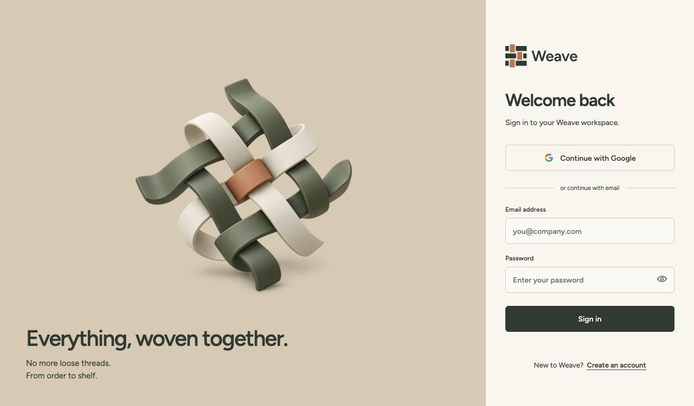

# WEA-24 verification evidence

Scope: [spec.md](spec.md), branch `feat/WEA-24/woven-login-artwork`, develop base `f041c95`. Publication checks run 2026-10-09. Production transfer matches the approved local implementation byte-for-byte across its eight source/media files. No dependency, lockfile, authentication policy, native app or WEA-10 spec changes are included.

## Scenario traceability

| Scenario | Requirement                | Public evidence                                                                                                                                                                         |
| -------- | -------------------------- | --------------------------------------------------------------------------------------------------------------------------------------------------------------------------------------- |
| S01      | FR-001/002, SC-001/002     | One-shot video, original still, usable input, stable media element across Clerk readiness/callback changes; historical browser playback and layout samples.                             |
| S02      | FR-003, SC-003             | Rejected autoplay, media error, readiness expiry, playback watchdog and late-event suppression.                                                                                         |
| S03      | FR-003/004, SC-003         | Shared/signup defaults, reduced/mobile/hidden first mounts, changed eligibility and unmount resource cleanup.                                                                           |
| S04      | FR-001/004/005, SC-002/003 | Static shared artwork and no pointer motion; decorative semantics in component; historical real-browser geometry/form inspection. No-JavaScript and broader browser matrix remain T009. |

## RED → GREEN and provenance

The original implementation was built and tested in this conversation before a dedicated ticket was requested. Its original WEA-10 S19/S20/S21/S22 labels map to WEA-24 S01/S02/S03/S04. [Original behavioral RED](evidence/woven-red.txt) and [original GREEN](evidence/woven-green.txt) are copied byte-for-byte. Initial wrong-TSX-configuration and CSS-import failures from that session are not behavioral RED evidence.

On the fresh WEA-24 branch, copied tests were relabeled and run **before** transferring source/assets. [Current-develop regression RED](evidence/base-regression-red.txt): 14 failures for missing video or the old bag image. Then source/media were transferred. [GREEN](evidence/green.txt): 14/14 pass. This is an additional base-regression check, not a claim that the implementation was freshly invented after those tests. One initial command used root-relative paths incorrectly; that command is excluded from behavioral evidence.

The reviewed refactor retains a single AuthShell through loading/form branches, isolates playback in the presentation hook and removes 17 obsolete global CSS lines. Production files remain 42-line component, 117-line hook and 47-line CSS Module. The test-only CSS loader adds no runtime dependency. Auth contracts, palette and typography are unchanged.

## Fresh publication checks

- [Full `npm run verify`](evidence/verify.txt): exit 0; lint/architecture, format, types, tests and production builds pass. Web tests 71/71, policy 32/32, API 2/2. Turbo reused unchanged task caches; the web test and production build ran on this branch.
- [Database/HTTP integration](evidence/integration.txt): exit 0, 3/3 pass against the documented local PostgreSQL environment. Includes unavailable-auth denial and database-outage behavior. No real account credentials were submitted.
- [Initial verify attempt](evidence/verify-format-initial.txt) stopped only because the generated, local `.specify/feature.json` was not formatted. Formatting it and rerunning produced the passing result above; this is not behavioral RED.
- Authored source/documentation passes `git diff --cached --check` with raw terminal logs excluded; captured logs retain their original trailing whitespace for provenance. Author/committer resolve to the pinned personal identity `cvvishnuu <cvishnuu01@gmail.com>`; scoped GitHub API identity verified as `cvvishnuu` before publication.
- The new checkout's offline dependency install completed package extraction but its prepare hook initially lacked permission to update shared Git config. The existing prepare hook was rerun with permission and passed; no hook was bypassed and the lockfile is unchanged.

Commands used the documented local DATABASE_URL for Prisma generation and integration. See [quickstart](quickstart.md). Hook checks run again on commit/push; remote CI and code-owner review are separate gates and are not claimed as completed here.

## Preserved browser and asset evidence

These are **historical observations of the byte-identical approved implementation**, not newly executed browser checks on WEA-24. A production build at localhost:4312 was inspected in the Codex in-app browser. [Playback samples](evidence/woven-browser-playback.json) show native H.264 playing at 22 ms and the terminal still at 1044 ms; sample timing is not an exact event-duration measurement. FFmpeg independently decoded 60 frames / 1.000 seconds with no audio in the original session.

The initial integration moved artwork 15.0625 px when Clerk's form appeared: [layout RED](evidence/woven-layout-red.json). Viewport anchoring corrected this: [layout GREEN](evidence/woven-layout-green.json) records identical x=238, y=120, width=420, height=420 before/after at 1280×720. Input editing/password visibility did not replay media. No credentials were submitted.

A first video candidate showed a lighter rectangle. Explicit sRGB-to-BT.709 pixel conversion corrected it; sampled hero/video background matched at RGB (214,202,180) after display-profile conversion. The final composition and all-side entrance were visually inspected. [Design documentation](../../docs/design/auth-artwork.md) contains export steps, source archive/licenses and media hashes. SHA-256 matches were rechecked on WEA-24.

## Sizes and limitations

The shipped MP4 is 169899 bytes (165.9 KiB); transparent WebP is 137740 bytes (134.5 KiB). No runtime animation package, WebGL renderer, frame loop, global store or storage write is introduced. The archived design source is outside the application graph. A prior isolated authored-entry measurement was 2127 minified bytes / 996 gzip with React/Next Image/CSS external; this is **not** a production route-bundle delta.

T009 remains open: Safari/Firefox codec/color/handoff, real mobile/reduced-motion/no-JavaScript rendering and actual throttled-network inspection. The original browser viewport API did not change the measured viewport, so that attempt is not counted as mobile verification. The Safari attempt was interrupted by active browser use. DOM tests cover eligibility/failure events but do not prove visual behavior across browsers. Remote CI/code-owner review must still pass. Open a draft PR; do not claim deployment or merge readiness.
